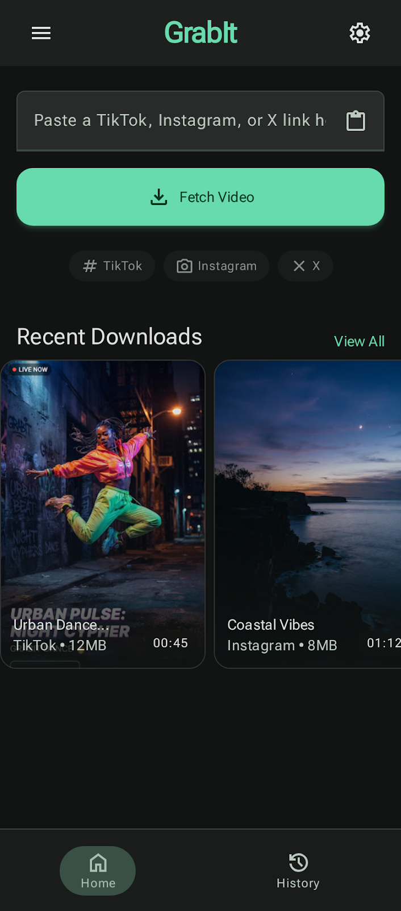
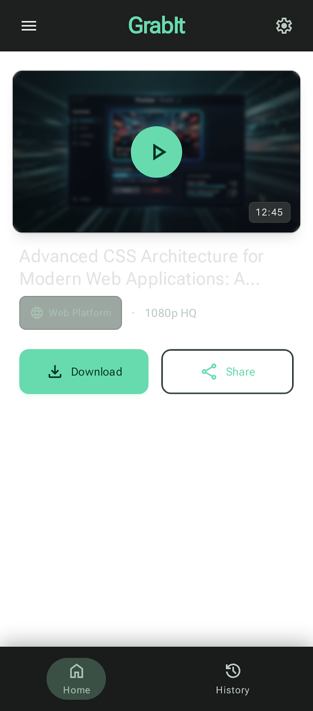

# GrabIt

GrabIt is a modern Flutter application for extracting and downloading media from popular social platforms such as TikTok, Instagram, and X. Built with a clean Material 3-inspired interface, it helps users preview content, monitor download progress, save media to the device gallery, and keep a history of previous downloads.

## Screenshots





## Why GrabIt?

- Paste a link and let the app detect the platform automatically.
- Handle Instagram-specific authentication requirements when needed.
- Preview media details before downloading.
- Keep a local history of downloaded files for later access.
- Save media directly to the gallery and adjust download preferences.

## Key Features

- Support for TikTok, Instagram, and X links
- Automatic platform detection and extraction flow
- Preview screen for review before download
- Real-time download progress feedback
- Local history tracking for completed downloads
- Settings for download location and gallery export
- Share-intent support so links can be opened directly from other apps

## Tech Stack

- Flutter and Dart
- BLoC for state management
- Go Router for navigation
- Dio and HTTP for network requests
- Hive and SharedPreferences for local persistence
- Permission Handler, Gal, Video Player, and WebView for media and storage workflows

## Project Structure

- lib/features/home — link input and extraction experience
- lib/features/preview — preview and download flow
- lib/features/history — download history management
- lib/features/settings — user preferences and storage settings
- lib/features/instagram_auth — Instagram authentication flow
- lib/data and lib/domain — repositories, data sources, entities, and use cases

## Getting Started

### Prerequisites

- Flutter SDK 3.12.2 or newer
- Android Studio, VS Code, or another Flutter-capable IDE
- A physical device or emulator

### Installation

1. Clone the repository.
2. Install dependencies.
3. Run the app.

```bash
git clone <your-repository-url>
cd video_grabber_app
flutter pub get
flutter run
```

### Build for Android

```bash
flutter build apk
```

## Usage

1. Open the app and paste a supported media link.
2. Review the extracted information on the preview screen.
3. Start the download and monitor its progress.
4. Access previous downloads from the history tab and adjust preferences in Settings.

## Notes

- Some platforms may require authentication or additional permissions for media access.
- Download location and gallery export behavior can be customized from Settings.

## Contributing

Contributions are welcome. If you want to improve the UI, add support for more platforms, or refine the download experience, feel free to open an issue or submit a pull request.

Please read [CONTRIBUTING.md](CONTRIBUTING.md) before getting started.

## License

This project is licensed under the MIT License. See [LICENSE](LICENSE) for details.
